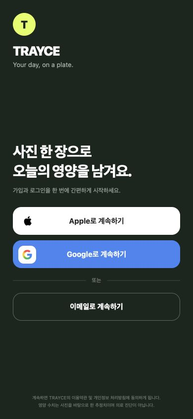
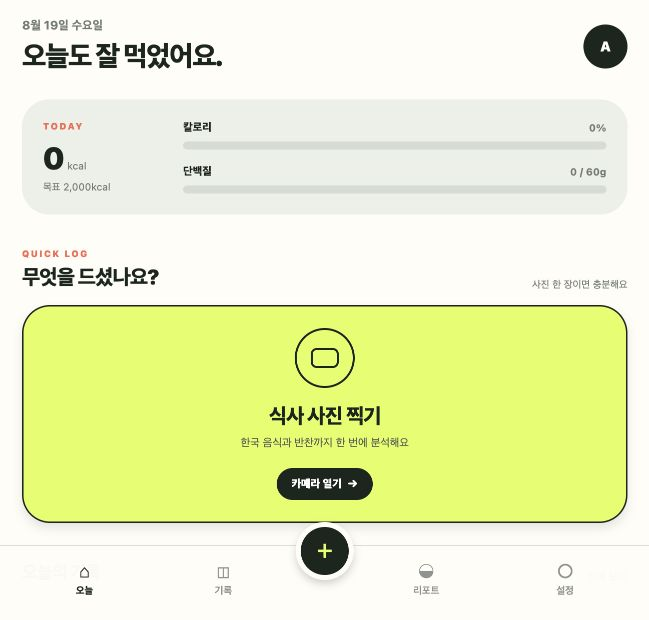
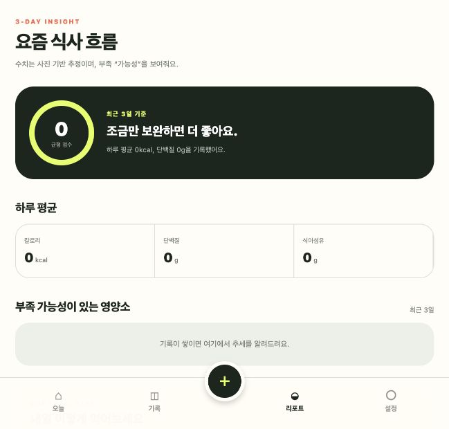
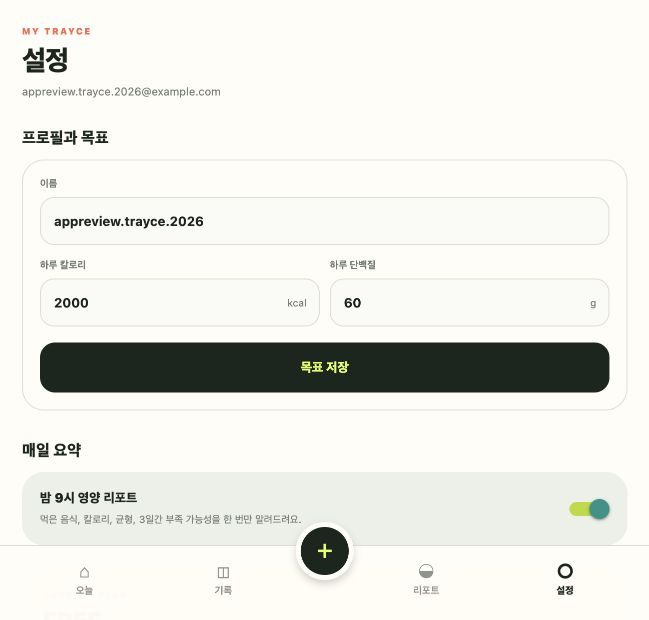

  
  <h1>TRAYCE</h1>
  
<strong>Your day, on a plate.</strong>

  
식사 사진 한 장으로 음식과 반찬을 구별하고 칼로리, 단백질, 영양 균형을 기록하는 한국형 푸드 저널

  

    
    
    
  

---

## Overview

TRAYCE는 매 끼니를 복잡하게 입력하지 않아도 되는 영양 기록 앱입니다. 사용자가 식사 사진을 올리면 한국 음식과 여러 반찬을 구별하고, 음식별 섭취량과 칼로리·단백질·탄수화물·지방을 추정합니다.

정밀한 식단 관리보다 **“오늘 무엇을 먹었고, 무엇이 부족할 가능성이 있는지”를 매일 가볍게 확인하는 경험**에 집중했습니다.

## Product Preview

  

 

| Today | 3-Day Insight | Settings |
|:---:|:---:|:---:|
|  |  |  |

## Key Features

- 식사 사진 기반 음식·반찬 구별
- 음식별 칼로리와 주요 영양소 추정
- 하루 섭취량과 개인 목표 비교
- 최근 3일 영양 흐름과 부족 가능성 안내
- 다음 식사를 위한 가벼운 실천 제안
- 매일 밤 영양 요약 알림
- Apple, Google, 이메일 로그인
- 앱 내 기록 및 계정 삭제

## Product Decisions

### 기록의 진입 장벽 낮추기

검색과 수기 입력 대신 사진 촬영을 핵심 행동으로 두었습니다. 홈 화면에서 한 번의 탭으로 분석을 시작할 수 있습니다.

### 한국 식사 구조 반영하기

한 접시 중심의 식단뿐 아니라 밥, 국, 메인, 여러 반찬으로 구성된 한국 식사를 함께 인식하는 흐름을 설계했습니다.

### 의료 정보가 아닌 생활 기록

영양 수치는 사진을 기반으로 한 추정치임을 앱 전반에 명시합니다. 진단이나 치료 대신 사용자가 자신의 식사 흐름을 이해하도록 돕는 데 목적이 있습니다.

### 단순한 리포트

복잡한 차트보다 오늘의 섭취량, 3일간의 흐름, 다음 한 끼에서 시도할 수 있는 행동을 우선적으로 보여줍니다.

## Tech Overview

| Area | Technology |
|---|---|
| Mobile | React Native, Expo, TypeScript |
| Backend | Supabase Database, Auth, Storage, Edge Functions |
| AI | Vision-based meal recognition and structured nutrition estimation |
| Authentication | Sign in with Apple, Google, Email |
| Distribution | EAS Build, TestFlight |

## Status

- iOS MVP 구현 완료
- 실제 기기 및 TestFlight 검증 진행
- App Store 출시 준비 중
- 첫 버전은 무료로 제공하며 사진 분석 횟수에 월간 제한 적용

## Role

제품 기획, UX/UI 설계, 모바일 앱 개발, 백엔드 연동, AI 분석 흐름 설계, TestFlight 배포까지 전체 과정을 진행했습니다.

---

  TRAYCE · 2026

